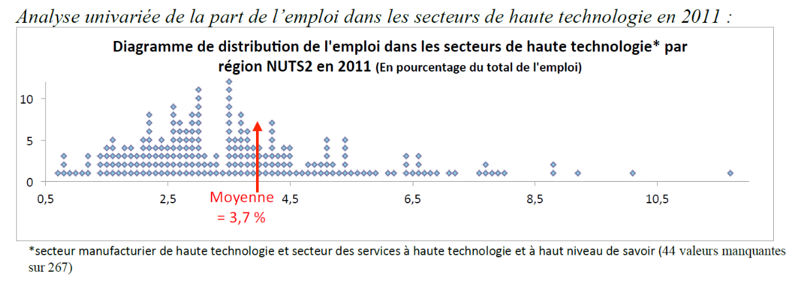
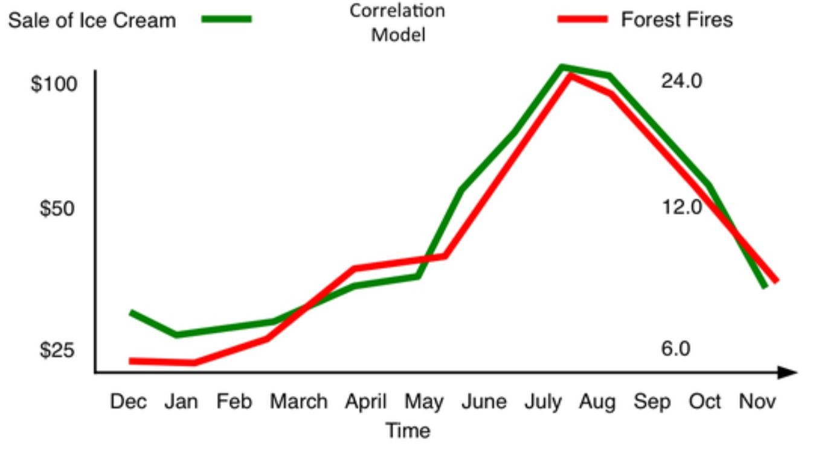
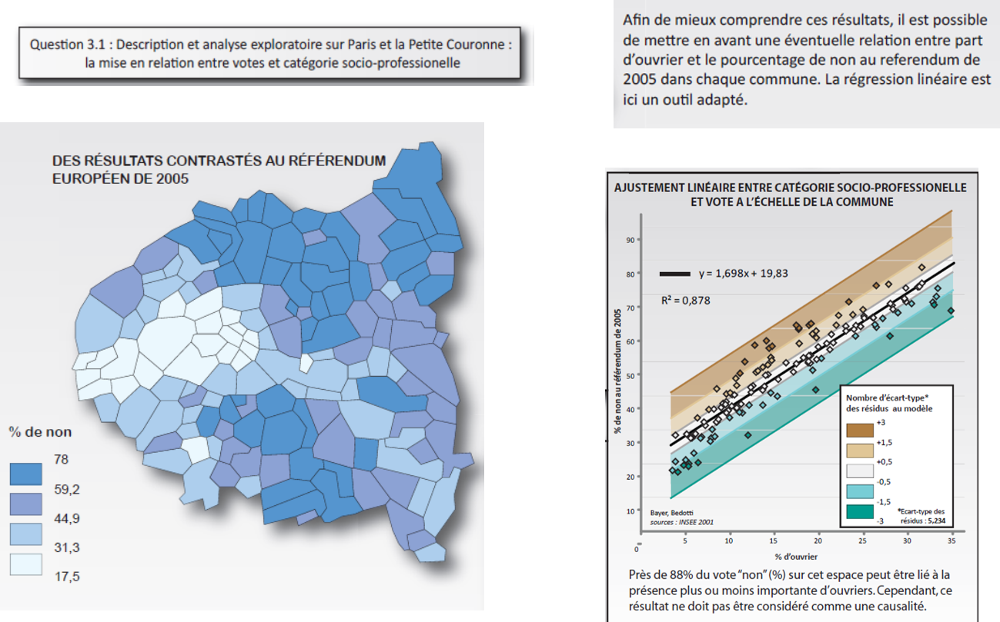
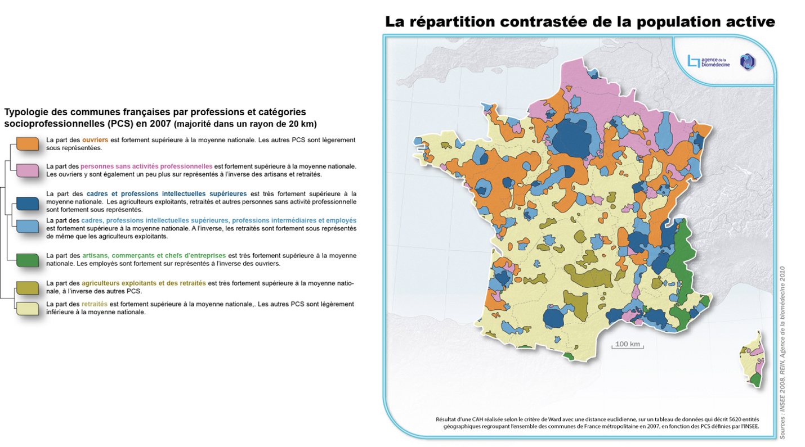
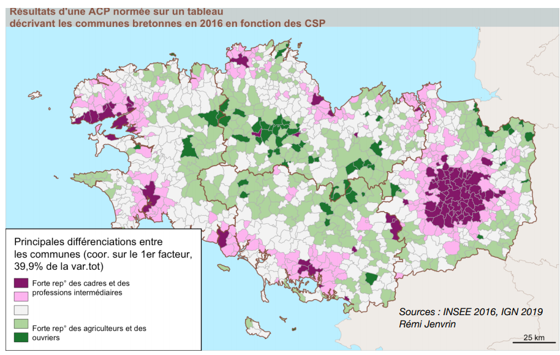
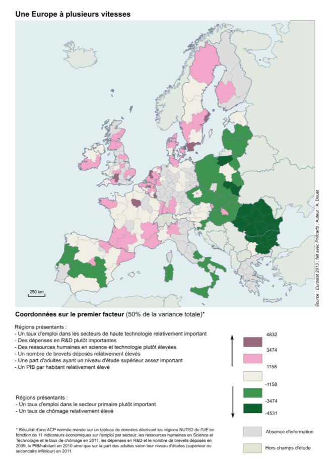
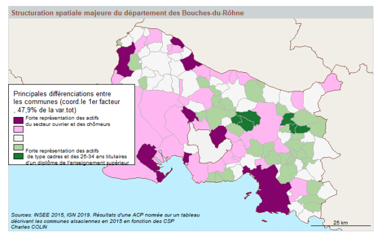

```{r setup, global_options,include=FALSE}
knitr::opts_chunk$set(
  dpi = 200,
  #fig.width = 7,
  #fig.height = 4,
  strip.white = T,
  #dev = "png",
  #dev.args = list(png = list(bg = "transparent")),
  message=FALSE,
  comment=NA,
  echo=FALSE,
  warning=FALSE,
  eval=TRUE
  
)
```

```{r include=FALSE}
source('./assets/functions.R')

# Les librairies
requiredPackages = c('knitr','png','grid','gridExtra',
                     'RColorBrewer','dotenv')

PackageFacile(requiredPackages)

load_dot_env(".env")
annee=Sys.getenv("annee")

```


class: center, middle, inverse, title-slide, animated, fadeIn
# Analyse des données Licence Pro `r annee`
# Présentation du cours <br /> 
<br />
### Florian Bayer


<div class="my-footer"><span>ENSG - Licence Pro `r annee` : analyse de données - Florian Bayer</span></div> 

---
class: animated, fadeIn
## Déroulement des séances
   
- 4 séances de 3 heures
- CM puis TD
- florian.bayer@gmail.com

<div class="my-footer"><span>ENSG - Licence Pro `r annee` : analyse de données - Florian Bayer</span></div> 

---
class: animated, fadeIn
##  Contenu de l’enseignement
<div class="my-footer"><span>ENSG - Licence Pro `r annee` : analyse de données - Florian Bayer</span></div> 


- Acquérir les **bonnes pratiques** de la démarche scientifique
- Les statistiques appliquées à la cartographie
- Principes et méthodes de traitement en **analyse de données**
- Analyse univariée et bivariée
- Méthodes de discrétisation
- Avec des séances de TD pour mettre en pratique les acquis


---
class: inverse, center, middle, animated, fadeIn
# Contenu de l'enseignement

<div class="my-footer-title "></div> 

---
class: animated, fadeIn
## Univarié


- Distinguer les types de **variables**, de **distributions**. **Décrire** une série de données, utiliser les **méthodes appropriées** à chaque type de données.
- Connaître les **principes** et **méthodes** de traitement et d’analyse de données.
- Maîtriser différentes méthodes de **représentation** de l’information statistique en géographie (notamment graphiques et cartographiques).

.center-img[
```{r echo=FALSE, out.width="90%"}

```
]


<div class="my-footer"><span>ENSG - Licence Pro `r annee` : analyse de données - Florian Bayer</span></div> 

---
class: animated, fadeIn
## Bivarié

- Mesurer l’**intensité** de la **relation** entre deux variables *quantitatives* à l’aide de la corrélation.
- **Modéliser** la nature d’une relation entre deux variables à l’aide des analyses de régression linéaire.

.center-img[
```{r echo=FALSE, out.width="70%"}

```
]
<div class="my-footer"><span>ENSG - Licence Pro `r annee` : analyse de données - Florian Bayer</span></div> 

---
class: animated, fadeIn
## Exemple d'application
<div style="display:table-cell; vertical-align:middle; horizontal-align:center">


.center-img[
```{r echo=FALSE, out.width="100%"}

```
]

</div>

<div class="my-footer"><span>ENSG - Licence Pro `r annee` : analyse de données - Florian Bayer</span></div> 

---
class: animated, fadeIn
## Exemple d'application

.center-img[
```{r echo=FALSE, out.width="75%"}
knitr::include_graphics("./assets/images/1_Intro/stat2.png")
```
] 

<div class="my-footer"><span>ENSG - Licence Pro `r annee` : analyse de données - Florian Bayer</span></div> 

---
class: animated, fadeIn
## Exemple d'application
<div style="display:table-cell; vertical-align:middle; horizontal-align:center">

.center-img[
```{r echo=FALSE, out.width="100%"}

```
] 

<div class="my-footer"><span>ENSG - Licence Pro `r annee` : analyse de données - Florian Bayer</span></div> 

---
class: animated, fadeIn
## Exemples de travaux -1

.zoom[ .pull-left[
```{r echo=FALSE, out.width="100%"}
knitr::include_graphics("./assets/images/1_Intro/Corrélation.JPG")
```
]

.pull-right[
```{r echo=FALSE, out.width="100%"}
knitr::include_graphics("./assets/images/1_Intro/diagcorr.png")
```
]]

<div class="my-footer"><span>ENSG - Licence Pro `r annee` : analyse de données - Florian Bayer</span></div> 

---
class: animated, fadeIn
## Exemples de travaux -2

.center-img[
```{r echo=FALSE, out.width="100%"}

```
]

<div class="my-footer"><span>ENSG - Licence Pro `r annee` : analyse de données - Florian Bayer</span></div> 

---
class: animated, fadeIn
## Exemples de travaux -3

.center-img[
```{r echo=FALSE, out.width="45%"}

```
]

<div class="my-footer"><span>ENSG - Licence Pro `r annee` : analyse de données - Florian Bayer</span></div> 

---
class: animated, fadeIn
## Exemples de travaux -4

.center-img[
```{r echo=FALSE, out.width="70%"}
knitr::include_graphics("./assets/images/1_Intro/acp_1.png")
```
]

<div class="my-footer"><span>ENSG - Licence Pro `r annee` : analyse de données - Florian Bayer</span></div> 

---
class: animated, fadeIn
## Exemples de travaux -4

.center-img[
```{r echo=FALSE, out.width="90%"}

```
]

<div class="my-footer"><span>ENSG - Licence Pro `r annee` : analyse de données - Florian Bayer</span></div> 


